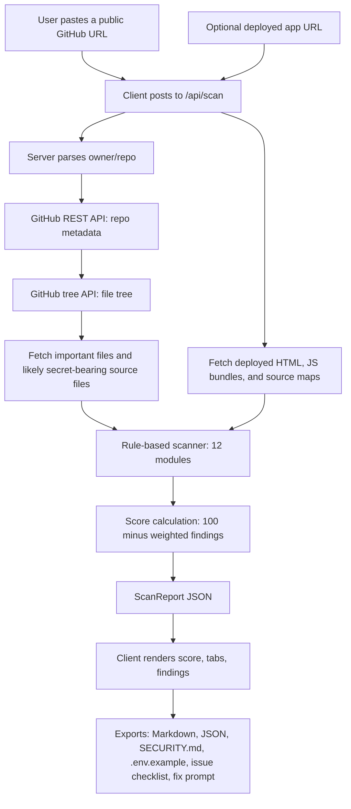
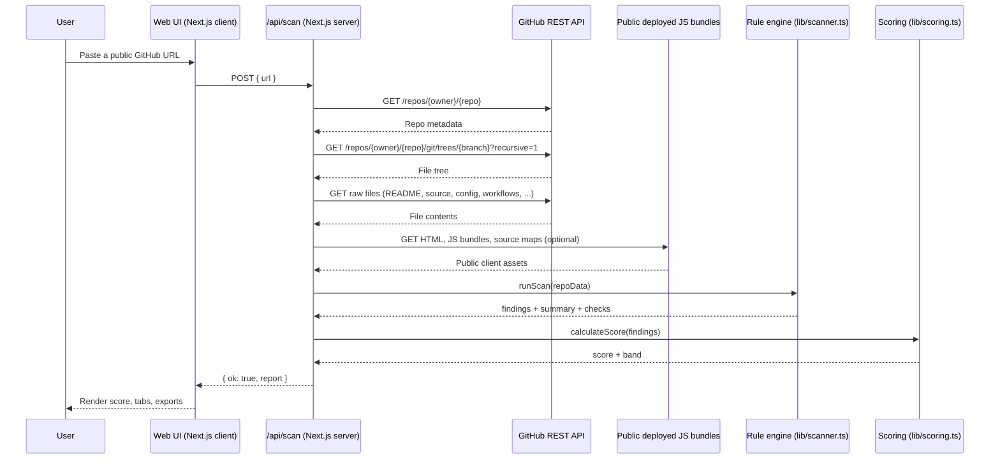

# RepoSec

> **Find the security gaps in your public GitHub repo — before attackers do.**

RepoSec is a defensive, read-only scanner that audits a public GitHub repository and returns a clear, prioritized security report. It checks for exposed `.env` files, missing `.gitignore` rules, hardcoded secret patterns in source and deployed JavaScript bundles, missing `SECURITY.md` and `CODEOWNERS`, weak CI, Dockerfile misconfigurations, dependency hygiene, and more.

The scanner **never modifies** the target repository and **never exfiltrates** its data. It is a hygiene tool, not an offensive one.

<p align="left">
  <a href="https://reposec.zanesense.dev"></a>
  <a href="https://github.com/zanesense/reposec/blob/main/LICENSE"></a>
  <a href="https://github.com/zanesense/reposec"></a>
  <a href="https://www.npmjs.com/package/reposec"></a>
  <a href="https://github.com/zanesense/reposec/stargazers"></a>
  <a href="https://github.com/zanesense/reposec/issues"></a>
  <a href="https://github.com/zanesense/reposec/pulls"></a>
  
  
  
  
</p>

> 🚀 **[Try the live demo →](https://reposec.zanesense.dev)** — paste any public GitHub URL and get a security report in seconds. No signup, no token required.

---

## 🧭 Quick Links

| Link | Description |
| --- | --- |
| 🌐 [Live demo](https://reposec.zanesense.dev) | Hosted scanner at `reposec.zanesense.dev` |
| 📦 [npm package](https://www.npmjs.com/package/reposec) | Run the local CLI with `npx reposec` |
| 📦 [Repository](https://github.com/zanesense/reposec) | Source code, issues, and releases |
| 🐛 [Issue tracker](https://github.com/zanesense/reposec/issues) | Report bugs and request features |
| 🔀 [Pull requests](https://github.com/zanesense/reposec/pulls) | Open a PR to contribute |
| ⭐ [Stargazers](https://github.com/zanesense/reposec/stargazers) | See who starred the project |
| 📄 [License](https://github.com/zanesense/reposec/blob/main/LICENSE) | MIT terms |

---

## 🗂️ Table of Contents

- [📖 Overview](#-overview)
- [✨ Features](#-features)
- [🧠 How It Works](#-how-it-works)
- [📂 Repository Structure](#-repository-structure)
- [🧰 Technologies](#-technologies)
- [📋 Requirements](#-requirements)
- [🛠️ Installation](#️-installation)
  - [npm CLI](#npm-cli)
  - [Production build](#production-build)
- [⚙️ Configuration](#️-configuration)
- [🛠️ Usage](#️-usage)
  - [Web UI](#web-ui)
  - [Local CLI](#local-cli)
  - [Programmatic API](#programmatic-api)
  - [Screenshots](#screenshots)
- [🧪 Testing](#-testing)
- [🔄 Project Flow](#-project-flow)
- [🔌 API Reference](#-api-reference)
  - [`POST /api/scan`](#post-apiscan)
- [💡 Examples](#-examples)
  - [Try these public repositories](#try-these-public-repositories)
  - [What a finding looks like](#what-a-finding-looks-like)
- [🚀 Deployment](#-deployment)
  - [Vercel (recommended)](#vercel-recommended)
  - [Docker](#docker)
  - [Self-hosted Node](#self-hosted-node)
- [🗺️ Roadmap](#️-roadmap)
- [🤝 Contributing](#-contributing)
- [📝 Changelog](#-changelog)
- [🛟 Troubleshooting](#-troubleshooting)
- [🔐 Security](#-security)
- [📄 License](#-license)
- [❤️ Acknowledgements](#️-acknowledgements)

---

## 📖 Overview

Most repository leaks do not start with a sophisticated exploit. They start with **a committed `.env`, a missing `SECURITY.md`, or a CI workflow with `write-all` permissions**. RepoSec is a fast, opinionated linter for your repository's public surface: paste a GitHub URL, get a security score, a category-by-category pass/fail breakdown, severity-grouped findings, and copy-pasteable fixes.

It is built for:

- 🧑‍💻 **Maintainers** who want a quick hygiene check before tagging a release.
- 🛡️ **Security engineers** who need a free, no-signup pre-audit for open-source projects.
- 📚 **Educators and students** who want to teach the basics of repo hardening with a live report.
- 🤖 **LLM-assisted workflows** — every finding ships with a fix prompt you can paste into your editor agent.

Why a defensive tool? Because catching mistakes early is cheaper, friendlier, and more effective than chasing them after a leak. RepoSec is intentionally framed as a **scanner**, not an exploit kit.

---

## ✨ Features

- 🔍 **12 static check modules** covering env hygiene, secrets, docs, scripts, GitHub features, container hygiene, community health, CI quality, repo metadata, source patterns, and dependencies.
- 🧠 **55+ secret patterns** out of the box, ported from the [gitleaks](https://github.com/gitleaks/gitleaks) ruleset: OpenAI, Anthropic (incl. admin), Groq, HuggingFace (user + org), Perplexity, Notion, GitHub (classic + fine-grained), GitLab, npm, PyPI, Slack (tokens + webhook URLs), Discord, Telegram, Twilio, SendGrid, Mailgun, Stripe (live + test), Google API, AWS (AKIA/ASIA + Bedrock ABSK + secret keys), Azure AD, Alibaba, Heroku, Pulumi, Fly.io, New Relic, Dynatrace, Grafana Cloud, Databricks, HashiCorp Vault (service + batch), Terraform Cloud, EasyPost, ReadMe, Prefect, Sourcegraph, Microsoft Teams webhooks, private key blocks, SSH public keys, generic JWTs, database URLs, curl auth in shell commands, and generic credential assignments.
- 📊 **Security score (0–100)** with bands: _Excellent_, _Good_, _Fair_, _Weak_, _Critical_.
- 🗂️ **Per-category breakdown** showing exactly which checks passed, failed, warned, or were missing.
- 🧾 **Severity-grouped findings** with masked evidence and a "Fix it like this" panel.
- 📥 **One-click exports** for:
  - Markdown report
  - JSON report
  - SARIF report for GitHub Code Scanning
  - `SECURITY.md` template
  - `.env.example` template
  - GitHub issue checklist
  - LLM fix prompt
- 🌗 **Polished UI** with a RepoSec design system, light/dark theming, and accessible shadcn-style primitives.
- 🧪 **Read-only by design** — no writes, no auth, no database, no telemetry beyond the GitHub API.
- 🐢 **No GitHub auth required** for public repos. Optional token raises the rate limit to 5000 req/h.

### New scanner capabilities

- **Full-repo secret file selection:** RepoSec fetches likely secret-bearing files across the tree, including JS/TS, Python, env files, shell scripts, Terraform, config files, keys, SQL, and source maps while skipping dependencies, build output, binary-heavy files, and oversized blobs.
- **Deployed bundle scanning:** paste an optional deployed app URL and RepoSec fetches the public page, discovers JavaScript bundles and source maps, and scans the same assets users can inspect in Chrome DevTools Sources. If the repo metadata has a homepage URL, the API attempts that scan automatically.
- **SARIF export:** reports can be exported as SARIF for GitHub Code Scanning and compatible security dashboards.
- **Baseline suppression:** reviewed findings can be ignored with `.reposecignore`, `reposec-baseline.json`, or `.reposec-baseline.json` by matching finding id, fingerprint, file, file:line, or title.
- **Local CLI:** scan private/local repos without uploading contents using `npx reposec .`; add `--history` to scan recent git history, `--format sarif` for CI output, and `--color` or `--no-color` to control terminal formatting.
- **Confidence and fingerprints:** secret findings include `confidence`, `fingerprint`, and optional `verified` metadata. Raw secret values stay server-side and evidence remains masked.
- **Opt-in verification:** supported GitHub, Stripe, and HuggingFace tokens can be verified live with the web checkbox, API `verify: true`, or CLI `--verify`.

---

## 🧠 How It Works

RepoSec is a server-rendered Next.js application. The browser is a thin client; the real work happens in `app/api/scan/route.ts`.



Key design choices:

- **Server-side fetching** keeps the GitHub token (if any) out of the browser and avoids CORS surprises.
- **Static rule engine** in `lib/scanner.ts` — easy to extend, deterministic, easy to test.
- **Bounded client-bundle scanning** only fetches public HTTPS pages/assets, caps file sizes, and blocks private/internal hosts.
- **No persistence**: a scan is a single request/response cycle. There is no database to leak.

---

## 🗂️ Repository Structure

```text
reposec/
├── app/
│   ├── layout.tsx                # Root layout: fonts, theme, nav, footer, toaster
│   ├── page.tsx                  # Landing page with sample repos
│   ├── globals.css               # Tailwind v4 + RepoSec design tokens
│   ├── loading.tsx               # Global loading skeleton
│   ├── not-found.tsx             # Custom 404
│   ├── scan/page.tsx             # Scan-in-progress + result view
│   ├── report/page.tsx           # Alias of /scan, re-runs from query params
│   └── api/scan/route.ts         # Server-side scanner endpoint
│
├── components/
│   ├── navbar.tsx                # Top navigation
│   ├── footer.tsx                # Site footer
│   ├── repo-input.tsx            # GitHub URL input + sample repos
│   ├── security-score.tsx        # SVG score gauge with band
│   ├── finding-card.tsx          # Severity-grouped finding card
│   ├── risk-badge.tsx            # Severity badge
│   ├── report-tabs.tsx           # Overview / Findings / Fixes / Checks / Files / Export
│   ├── export-button.tsx         # Copy + download for one export item
│   ├── scan-view.tsx             # Scan state machine + UI
│   ├── star-prompt.tsx           # Friendly star CTA
│   ├── doodles.tsx               # Decorative SVG illustrations
│   └── ui/                       # shadcn-style primitives (button, card, input, badge, tabs, skeleton, dialog)
│
├── lib/
│   ├── baseline.ts               # .reposecignore / baseline suppression
│   ├── client-bundle.ts          # Public deployed JS bundle and source-map fetcher
│   ├── fingerprint.ts            # Stable secret fingerprints for dedupe/baselines
│   ├── github.ts                 # GitHub API client, URL parsing, error model
│   ├── local-repo.ts             # Local filesystem and git-history scan loader
│   ├── rules.ts                  # Secret pattern catalog + severity helpers
│   ├── scan-targets.ts           # Shared scannable file/path selection
│   ├── scanner.ts                # Rule-based scanner (12 modules, per-check pass/fail)
│   ├── scoring.ts                # Score calculation and band assignment
│   ├── exporters.ts              # Markdown / JSON / SARIF / templates / fix prompt
│   ├── types.ts                  # Shared TypeScript types
│   ├── verification.ts           # Opt-in supported-token verification
│   └── utils.ts                  # cn(), formatters, secret masking
│
├── public/
│   ├── favicon.svg               # RepoSec shield favicon
│   └── screenshots/              # Captured Playwright screenshots of the live UI
│
├── scripts/
│   ├── capture-screenshots.mjs   # Playwright screenshot pipeline (npm run screenshots)
│   ├── reposec-cli.mts           # Local CLI scanner (npm run scan:local)
│   ├── test-client-bundle.mts    # Deployed JS bundle regression test
│   └── test-scanner.mts          # Rule-engine regression tests
│
├── .env.example                  # Template for optional GITHUB_TOKEN
├── eslint.config.mjs             # ESLint 9 + Next + TypeScript configs
├── next.config.ts                # Next.js config
├── postcss.config.mjs            # Tailwind v4 PostCSS plugin
├── tsconfig.json                 # Strict TypeScript config
├── package.json                  # Scripts and dependencies
└── README.md                     # You are here
```

RepoSec is distributed under the MIT License. See [`LICENSE`](LICENSE) for the full terms.

---

## 📦 Technologies

| Layer            | Choice                                                                              |
| ---------------- | ----------------------------------------------------------------------------------- |
| Framework        | [Next.js 16](https://nextjs.org/) (App Router)                                      |
| Language         | [TypeScript 5](https://www.typescriptlang.org/) (strict mode)                       |
| UI runtime       | [React 19](https://react.dev/)                                                      |
| Styling          | [Tailwind CSS v4](https://tailwindcss.com/) + RepoSec design tokens                 |
| UI primitives    | shadcn-style components, locally authored (no CLI dependency)                       |
| Icons            | [Lucide](https://lucide.dev/)                                                       |
| Toasts           | [Sonner](https://sonner.emilkowal.ski/)                                             |
| Class utilities  | `clsx`, `tailwind-merge`, `class-variance-authority`                                |
| Animations       | `tw-animate-css`                                                                    |
| Data source      | GitHub REST API + raw file downloads (no auth required)                             |
| Visual regression| [Playwright](https://playwright.dev/) (screenshot capture script)                   |
| Linting          | ESLint 9 + `eslint-config-next` (core-web-vitals + typescript)                      |
| Type checking    | `tsc --noEmit`                                                                      |

---

## ✅ Requirements

- **Node.js** ≥ 18.18 (Node 20 LTS recommended)
- **npm** ≥ 9 (or any compatible package manager: pnpm, yarn, bun)
- A modern browser (the UI uses CSS `:has()`, color-mix, and modern flex/grid)
- **Optional:** a GitHub personal access token for higher rate limits

> No database, no Docker, no cloud account required for the MVP.

---

## 🚀 Installation

```bash
# 1. Clone the repository
git clone https://github.com/zanesense/reposec.git
cd reposec

# 2. Install dependencies
npm install

# 3. (Optional) Set up environment variables
cp .env.example .env.local
# then edit .env.local and add your GITHUB_TOKEN

# 4. Start the dev server
npm run dev
```

Open <http://localhost:3000> and paste a public GitHub URL, e.g. `https://github.com/vercel/next.js`.

### npm CLI

Run RepoSec on any local checkout without installing the web app:

```bash
# One-off scan with npm
npx reposec .

# Or install globally
npm install -g reposec
reposec .
```

### Production build

```bash
npm run build
npm run start
```

---

## 🔧 Configuration

RepoSec is configured entirely through environment variables. There are no config files to edit and no database to provision.

| Variable       | Description                                                                                     | Required | Example       |
| -------------- | ----------------------------------------------------------------------------------------------- | -------- | ------------- |
| `GITHUB_TOKEN` | Personal access token (classic or fine-grained, public repos only). Raises rate limit to 5000/h. | No       | `ghp_xxx...`  |

Create a local `.env.local` (or `.env`) from the template:

```bash
cp .env.example .env.local
```

If you skip this step, the scanner still works — you just share the 60 req/h anonymous rate limit. Rate-limit hits surface as a friendly error in the UI, courtesy of the `GitHubError` model in `lib/github.ts:54`.

---

## 🛠️ Usage

### Web UI

1. Run `npm run dev` and open <http://localhost:3000>.
2. Paste a public GitHub URL (or pick a sample repo).
3. Optionally paste a deployed app URL to scan production JavaScript bundles and source maps.
4. Optionally enable supported-token verification for GitHub, Stripe, and HuggingFace tokens.
5. Watch the per-stage loader (metadata → tree → files → deployed bundles → rules → score).
6. Explore the report tabs:
   - **Overview** — score gauge, severity counts, repo metadata, category breakdown.
   - **Findings** — every finding as a card with masked evidence and a "Fix it like this" panel.
   - **Fixes** — consolidated checklist.
   - **Checks** — full per-check pass/fail/warn table.
   - **Files** — file-grouped view of findings.
   - **Export** — copy or download the artifacts.

### Local CLI

Scan a local checkout without using the web UI:

```bash
# Markdown report to stdout
npx reposec .

# Include recent git history blobs
npx reposec . --history

# Write SARIF for GitHub Code Scanning or CI dashboards
npx reposec . --format sarif --out reposec.sarif

# Opt in to supported live token verification
npx reposec . --verify

# Force or disable colored terminal Markdown output
npx reposec . --color
npx reposec . --no-color
```

Inside this repository, `npm run scan:local -- .` runs the same CLI from source.

Baseline files are honored in both web/API and local CLI scans:

```text
# .reposecignore
src/config.ts:12
secret-generic-api-key-assignment-src/config.ts-12
0123456789abcdef
```

```json
{
  "ignore": [
    { "file": "src/config.ts", "line": 12 },
    { "fingerprint": "0123456789abcdef" }
  ]
}
```

### Programmatic API

The scanner is exposed as a single POST endpoint:

```http
POST /api/scan
Content-Type: application/json

{
  "url": "https://github.com/vercel/next.js",
  "siteUrl": "https://nextjs.org",
  "verify": false
}
```

Successful response:

```json
{
  "ok": true,
  "report": {
    "repo": { "owner": "vercel", "repo": "next.js", "defaultBranch": "canary", "isPrivate": false },
    "score": 86,
    "scoreBand": "good",
    "summary": { "totalChecks": 42, "passed": 36, "failed": 4, "totalFindings": 6, "...": "..." },
    "findings": [ { "id": "...", "title": "...", "severity": "high", "category": "secret", "...": "..." } ],
    "scannedAt": "2026-06-05T08:00:00.000Z",
    "durationMs": 1480
  }
}
```

Error responses use stable `code` values: `not_found`, `private`, `rate_limited`, `invalid`, `unknown`.

### Screenshots

**Landing page**


**Scanning state**


**Report overview**


**Findings tab**


**Export tab**


To regenerate them: `npm run screenshots` (builds the app, serves it on port 4001, and captures each route with Playwright).

---

## 🧪 Testing

RepoSec ships with scanner regression tests, a deployed-bundle fixture test, screenshot-driven visual baselines, and a strict type/lint pipeline.

```bash
# Type check (strict TypeScript)
npm run typecheck

# Lint (ESLint 9 + Next + TypeScript)
npm run lint

# Build the production bundle (catches many runtime issues at build time)
npm run build

# Run rule-engine and deployed-bundle scanner regressions
npm run test:scanner

# Regenerate the public/screenshots/ baseline
npm run screenshots

# Wipe build artifacts and the TS incremental cache
npm run clean
```

---

## 📊 Project Flow

End-to-end scan lifecycle:



---

## 📚 API Reference

### `POST /api/scan`

Validates a public GitHub URL, fetches repo data, runs the static scanner, and returns a `ScanReport`.

**Request body**

| Field | Type | Required | Description |
| ----- | ---- | -------- | ----------- |
| `url` | string | yes | Full public GitHub URL, e.g. `https://github.com/owner/repo`. Trailing slashes and `.git` suffixes are tolerated. |
| `siteUrl` | string | no | Optional public deployed app URL. RepoSec fetches public JS bundles and source maps from this site and scans them for secrets. HTTPS is enforced outside tests. |
| `verify` | boolean | no | Opt in to supported live token verification. Currently GitHub, Stripe, and HuggingFace are checked with bounded requests. Defaults to `false`. |

**Response (200)**

```ts
interface ScanResponse {
  ok: true;
  report: ScanReport;
}
```

Where `ScanReport` is defined in `lib/types.ts` and includes `repo`, `score`, `scoreBand`, `summary`, `findings`, `filesChecked`, `fileGroups`, `scannedAt`, and `durationMs`. Secret findings may also include `confidence`, `fingerprint`, and `verified` metadata.

**Error responses**

| Status | `code`         | Meaning                                                       |
| ------ | -------------- | ------------------------------------------------------------- |
| 400    | —              | Invalid JSON body or unparseable URL.                         |
| 404    | `not_found`    | The repository does not exist or is not public.               |
| 502    | `rate_limited` | GitHub rate limit reached (anonymous or token).               |
| 502    | `private`      | The repository is private or access is restricted.            |
| 500    | `unknown`      | Unexpected server error.                                      |

Example error body:

```json
{
  "error": "API rate limit exceeded for your IP.",
  "code": "rate_limited",
  "status": 403
}
```

---

## 🧩 Examples

### Try these public repositories

| Repository | Why scan it                                  |
| ---------- | -------------------------------------------- |
| `vercel/next.js` | Large, well-run project — should score in the _Good_ band. |
| `facebook/react` | Tests CI and metadata heuristics at scale. |
| `expressjs/express` | Classic Node.js project — interesting `.gitignore` and CI behavior. |

### What a finding looks like

```json
{
  "id": "secret-stripe-live",
  "title": "Stripe live secret key",
  "description": "Looks like a live Stripe secret key. Roll the key if real.",
  "severity": "critical",
  "category": "secret",
  "confidence": "high",
  "fingerprint": "0123456789abcdef",
  "verified": false,
  "file": "src/config.ts",
  "line": 12,
  "evidence": "sk_l_********************def0",
  "fix": "Move the key to an environment variable and reference it via process.env.",
  "fixPrompt": "In src/config.ts:12, replace the hardcoded Stripe key with an env var..."
}
```

The scanner masks secrets to `prefix****suffix` before they ever leave the server, so the UI never displays the raw value.

---

## 🚢 Deployment

RepoSec is a standard Next.js 16 app. It works on any platform that supports the Node.js runtime.

### Vercel (recommended)

```bash
# Install the Vercel CLI if you don't have it
npm i -g vercel

# Deploy from the project root
vercel
```

Add `GITHUB_TOKEN` as an environment variable in the Vercel project settings if you want a higher rate limit.

### Docker

> **TODO:** A Dockerfile is not yet committed. The recommended shape is:
>
> ```Dockerfile
> # syntax=docker/dockerfile:1
> FROM node:20-alpine AS deps
> WORKDIR /app
> COPY package.json package-lock.json ./
> RUN npm ci
>
> FROM node:20-alpine AS builder
> WORKDIR /app
> COPY --from=deps /app/node_modules ./node_modules
> COPY . .
> RUN npm run build
>
> FROM node:20-alpine AS runner
> WORKDIR /app
> ENV NODE_ENV=production
> COPY --from=builder /app/.next ./.next
> COPY --from=builder /app/public ./public
> COPY --from=builder /app/package.json ./package.json
> COPY --from=builder /app/node_modules ./node_modules
> EXPOSE 3000
> CMD ["npm", "run", "start"]
> ```

### Self-hosted Node

```bash
npm run build
GITHUB_TOKEN=ghp_xxx npm run start
```

The server listens on port `3000` by default. Override with `PORT=4000 npm run start`.

---

## 🧭 Roadmap

Planned and aspirational improvements:

- 🧠 **Optional LLM layer** — "Bring Your Own Key" provider to add narrative remediation to the report.
- 🧪 **Unit tests** — expand the current scanner regression suite into Vitest coverage for `lib/scanner.ts`, `lib/rules.ts`, and `lib/scoring.ts`.
- 🐳 **Container hardening** — committed `Dockerfile` and `docker-compose.yml`.
- 🌐 **i18n** — multi-language report exports.
- 🔌 **GitHub App mode** — comment the report on PRs via a public GitHub App.
- 📦 **More ecosystems** — Python (`requirements.txt`, `pyproject.toml`), Go (`go.mod`), Rust (`Cargo.toml`) lockfile and audit checks.
- 🪝 **Webhooks** — scheduled scans for the repos you watch.
- 🪪 **License detection** — extend SPDX detection beyond the GitHub API metadata.

- 🔐 **More verifiers** — add safe opt-in verification support for more providers without exposing raw secrets in reports.

> **TODO:** A separate `ROADMAP.md` is not currently checked in. The list above is the source of truth until it is.

---

## 🤝 Contributing

Contributions are very welcome — especially new secret patterns and new check modules.

1. **Fork** the repository on GitHub.
2. **Clone** your fork and create a feature branch:
   ```bash
   git checkout -b feat/add-discord-token-pattern
   ```
3. **Install** dependencies and start the dev server:
   ```bash
   npm install
   npm run dev
   ```
4. **Make your changes.** When adding a new secret pattern, edit `lib/rules.ts:10` and follow the existing `SecretPattern` shape.
5. **Run the quality checks** before committing:
   ```bash
   npm run lint
   npm run typecheck
   npm run build
   ```
6. **Commit** with a descriptive message:
   ```bash
   git commit -m "feat(scanner): add Discord bot token pattern"
   ```
7. **Push** your branch and open a **pull request** against `main`:
   ```bash
   git push origin feat/add-discord-token-pattern
   ```

Please open an issue first if your change is large or design-related.

---

## 📝 Changelog

> **TODO:** A `CHANGELOG.md` is not yet committed. Notable milestones to seed it with:

- **0.1.0** — Initial MVP. Landing page, 12 check modules, 55+ secret patterns (ported from the gitleaks ruleset), score + band, exports (Markdown, JSON, `SECURITY.md`, `.env.example`, issue checklist, fix prompt), Playwright screenshot baseline.
- **0.2.0** — Full-tree secret target selection, deployed JavaScript bundle scanning, SARIF export, local CLI, git-history scanning, baseline suppression, confidence/fingerprint metadata, opt-in supported-token verification, and bundle scanner regression tests.

---

## 🐛 Troubleshooting

| Symptom | Cause | Fix |
| ------- | ----- | --- |
| `API rate limit exceeded` on the first scan | Anonymous GitHub limit (60 req/h) was hit. | Add `GITHUB_TOKEN` to `.env.local` and restart the dev server. |
| `Repository not found` for a repo you can see in the browser | The URL is wrong, the repo is private, or it was renamed. | Double-check the URL. RepoSec only scans public repos. |
| Scan returns 0 findings and a perfect score | The repo is small or has no scannable files (yet). | Try a larger public repo, e.g. `vercel/next.js`. |
| `.env.local` is missing after `cp .env.example .env.local` on Windows PowerShell | `cp` is not a native cmdlet. | Use `Copy-Item .env.example .env.local` instead. |
| `npm run screenshots` fails | Playwright browsers are not installed. | Run `npx playwright install` once before the first capture. |
| Deployed bundle scan finds no assets | The site URL is missing, not HTTPS, blocks server-side requests, or does not expose JS bundles through normal script/modulepreload tags. | Enter the public production URL manually and confirm the bundles are reachable without authentication. |
| CLI SARIF output is empty | No findings matched after baseline suppression. | Run `npx reposec . --format json` and inspect `summary.checks` and `filesChecked`. |
| A reviewed finding keeps returning | No baseline entry matches its id, fingerprint, file, or file:line. | Add the exact finding location or fingerprint to `.reposecignore` or `reposec-baseline.json`. |
| Build complains about a missing `next-env.d.ts` | The file is generated by Next.js on first run. | Run `npm run dev` once, or delete `.next` and rebuild. |
| Type errors after pulling new code | The incremental cache is stale. | Run `npm run clean` followed by `npm run typecheck`. |

---

## 🔒 Security

RepoSec is a **defensive** security tool. It is designed to help maintainers find their own mistakes, not to weaponize findings.

- ✅ The scanner is **read-only**. It never writes to the target repository.
- ✅ The scanner is **stateless**. No scan data is stored on the server.
- ✅ The scanner **masks secrets** before they appear in the UI or exports.
- ✅ Live verification is **opt-in** and raw candidates are discarded before reports are returned.
- ✅ Deployed bundle scanning is bounded to public HTTPS assets and blocks private/internal hosts.
- ✅ The scanner is **branded defensively** — the copy and code avoid language like "hack", "exploit", "bypass", or "steal".

To report a vulnerability in RepoSec itself, please open a private security advisory on GitHub:

https://github.com/zanesense/reposec/security/advisories/new

For supported versions and response timelines, see [`SECURITY.md`](SECURITY.md).

**Never** commit real secrets to this repository. The included `.gitignore` already excludes `.env*` (with `.env.example` whitelisted as a template).

---

## 📄 License

RepoSec is licensed under the MIT License. See [`LICENSE`](LICENSE) for the full license text.

---

## ❤️ Acknowledgements

- 🛡️ Inspired by the public hardening checklists from **GitHub**, **OWASP**, and **Snyk**.
- 🎨 UI primitives adapted from the [shadcn/ui](https://ui.shadcn.com/) patterns, locally authored and customised.
- 🖼️ Icons by [Lucide](https://lucide.dev/).
- 🔔 Toasts by [Sonner](https://sonner.emilkowal.ski/).
- 🤖 Build tooling by [Next.js](https://nextjs.org/), [React](https://react.dev/), [Tailwind CSS](https://tailwindcss.com/), and [TypeScript](https://www.typescriptlang.org/).
- 🧪 Visual baseline by [Playwright](https://playwright.dev/).
- 💛 Thanks to every maintainer who takes repo hygiene seriously.

---

<p align="center">
  <a href="#reposec">⬆️ Back to top</a>
  &nbsp;·&nbsp;
  <a href="https://reposec.zanesense.dev">🌐 Live demo</a>
  &nbsp;·&nbsp;
  <a href="https://github.com/zanesense/reposec">📦 Repository</a>
  &nbsp;·&nbsp;
  <a href="https://github.com/zanesense/reposec/issues">🐛 Report a bug</a>
  &nbsp;·&nbsp;
  <a href="https://github.com/zanesense/reposec/blob/main/LICENSE">📄 MIT License</a>
</p>
